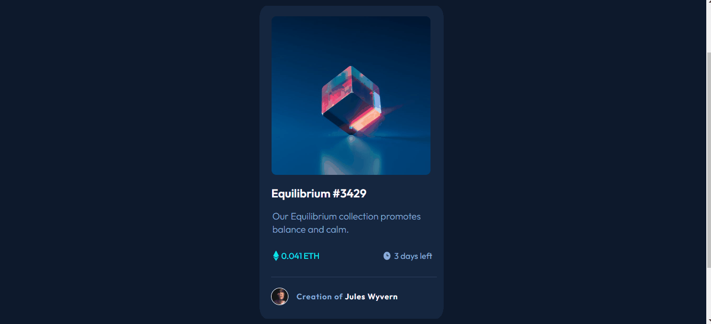

# card-component-frontend-m

## card-component

 _______
 card, made to train the skills of Dev Frontend, in Frontend Mentor... In this card was used flex box, to position the element, sand figma to see the design and inspect the elements, this card required a lot of html and css skills...
 _____
As requested in the challenge, I made the responsive mode, in addition to the activated mode, where I made some effects using the pseudo hover element.
____

### Challenges

- [x] Create car for desktop.
- [x] Effects activated mode.
- [x] Responsiveness

_____

### Designer of how the project should be

____
### challenge ready:

## website link ready:
<a href="https://card-component-steel.vercel.app/">Card_Component_Frontend-Mentor./</a>

## used tools:
 * HTML5
 * CSS3
 * Figma
